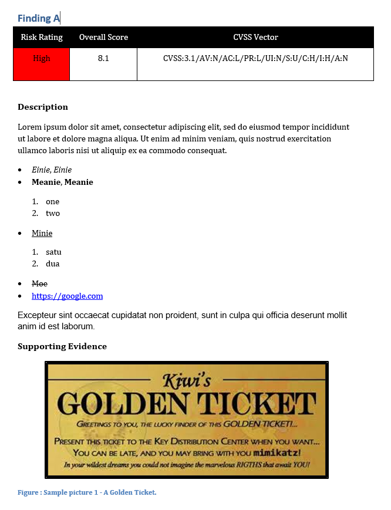
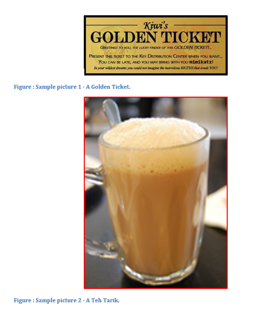
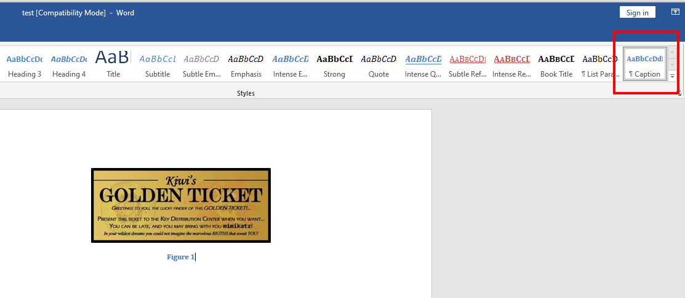
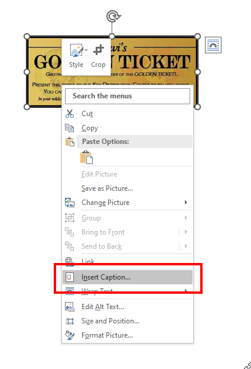
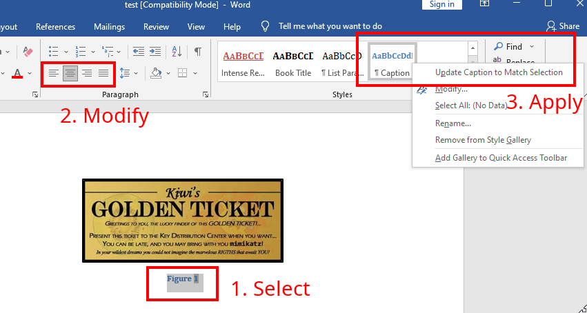

# Penetration Testing Report Workflow
Suppose I have a finding to report that should look roughly like this:



Basically, there is a table with a colored cell, a score and a long string. Then followed with a description under a bold heading with a slightly bigger font. The description content consists of bullet and numerical lists of bold, italic, underlined, strikethrough and links. The last description paragraph has a different font. then followed with a picture with caption.

## Specialized Markdown Syntax
To create that using this tool, you would simply create a .md file that looks like the following:

```
# Finding A

<table style='Table Grid' column_widths='1in, 1.2in, 4.2in'>
<para before=6pt spacing=1.15 after=6pt align=center>
|<cell color='#000000'>Risk Rating</cell>|<cell color='#000000'>Overall Score</cell>|<cell color='#000000'>CVSS Vector</cell>|
|---|---|---|
|<cell color='#ff0000'>High</cell>|8.1|CVSS:3.1/AV:N/AC:L/PR:L/UI:N/S:U/C:H/I:H/A:N|
</para>
</table>

<br>

<font size=12pt>**Description**</font>

Lorem ipsum dolor sit amet, consectetur adipiscing elit, sed do eiusmod tempor incididunt ut labore et dolore magna aliqua. Ut enim ad minim veniam, quis nostrud exercitation ullamco laboris nisi ut aliquip ex ea commodo consequat.

- <i>Einie</i>, _Einie_
- <b>Meanie</b>, __Meanie__
    1. one
    2. two
- <u>Minie</u>
    1. satu
    2. dua
- <strike>Moe</strike>
- <https://google.com>

<font name=Arial>Excepteur sint occaecat cupidatat non proident, sunt in culpa qui officia deserunt mollit anim id est laborum.</font>

<font size=12pt>**Supporting Evidence**</font>

<align center>
</img>
</align>
```

Save the Markdown (I'll use 'a.md') and use the tool with `docxtool.py a.md` to generate it. Note that you will need the image '[pic-1.png](pic-1.png)' in the same directory as you run the tool.

The tool supports formatting features such as table widths, font sizes, types and modifiers such as bold, italic etc. In addition, it can also support figures with captions, figure width and borders. Like markdown, the tool also support generation of bullet and numerical lists in the resulting .docx.

### More Figures and Alignment
In this example, we only have 1 image added. In real use-cases, you will likely need to add many figures. In that case you can simply just add the `` tag as such (An empty line is needed between the tags for line separation).

If you do not want your figure to be aligned at the center, you can remove the surrounding `<align>` tag as well.

```
<align center>
</img>

</img>
</align>
```

Which results in the following output.



### Aligning the Caption
The tool currently does not support alignment of caption out of the box. To address this, you will need a template docx file.

The best way to make a template docx file is to use an existing report with the format you would like to copy from. Open the template file and delete all content with 'Ctrl+A' and 'Del'.

To have your caption aligned center, you will need to make use of default styles on the template file. On your Home tab, select the 'Caption' style.



If you cannot find the 'Caption' style, just insert a caption manually and you will then see it.



To modify the caption default style, select on the (inserted) caption and change the alignment or any styling (e.g., bold, italic) that you want. Then right click on the caption default style and click 'Update Caption to Match Selection'.



Delete the figure and the caption from your template (the template should always be empty!) and save it. Then to use it, do `docxtool.py -t <path-to-template.docx> <your-writeup.md>`. The caption should be centered now.

### Other Styling
The section 'Aligning the Caption' not only applies to caption, but to all default styling that you would like to enforce in your generated .docx. For example, if you want your default font to be 'Verdana' pt 9 with justified aligment, simply just edit the 'Normal' style and save the template.

When you generate a report using the template, all paragraph font will default to the 'Normal' style unless you override it with the markdown syntax.

This effect applies to Table styling as well!

## Boilerplate Generation
Okay, now that we got everything we need to fully customize our report. But it seems kinda tedious to write everything up for each finding.

That's where text-based format shines, because it can be easily integrated with other tools! This toolset comes with a supporting utility `boilergen.py`, which can effectively create boilerplates for you to write your findings on. Though, you can always write your own tool to create the markdown files since they are text-based anyways.

### Creating a Boilerplate (FOR VAPT)
To create a default boilerplate using the supporting utility, do `boilergen.py vapt dtpt-1 <finding-name> -c <CVSS vector>`. 'dtpt-1' is the default built-in boiler template that I find very useful for my engagements.

You can use your own boiler template by specifying it like `boilergen.py vapt my-boiler.md <finding-name> -c <cvss vector>`. Do refer to the [default template](../../boiler_templates/dtpt-1.md?plain=1) for reference.

The boilerplate generation tool automatically parses the CVSS vector and fill in the severity rating as well as the color, so you no longer need to fumble the colors around when writing a report.

The generated boilerplate looks like [this](61_findingb.md?plain=1). You would then just fill in the details.

## Wrapping It Up
Finally, you have a bunch of markdown files together and you want to generate the full report. Here's is one way to do it.

I typically create a directory for each project I am working on, with the following tree structure
```
- project
    - findings
        - 80_sqlinject.md
        - 30_bruteforce.md
        ...
    - screencaps
        - sqli-1.png
        - sqli-2.png
        - bflogin-1.png
        ...
```

Then to create the entire findings report, I would just run the following command under 'project'.

`docxtool.py -t <my-engagement-template.docx> -o <output_file.docx> findings/`

which will create a .docx filled with the findings. Next is just to copy all of the generated content in the .docx and use it wherever I need to. You can even streamline your entire reporting process to have the tool create the full report, but I find that this is the most adaptable method if the report layout needs to be changed frequently depending on projects.

## Conclusion

I find that the tool has greatly helped me save time when doing penetration testing reports. It may have other uses too. Feel free to email me of your ideas at <chia_jason96@live.com>.
